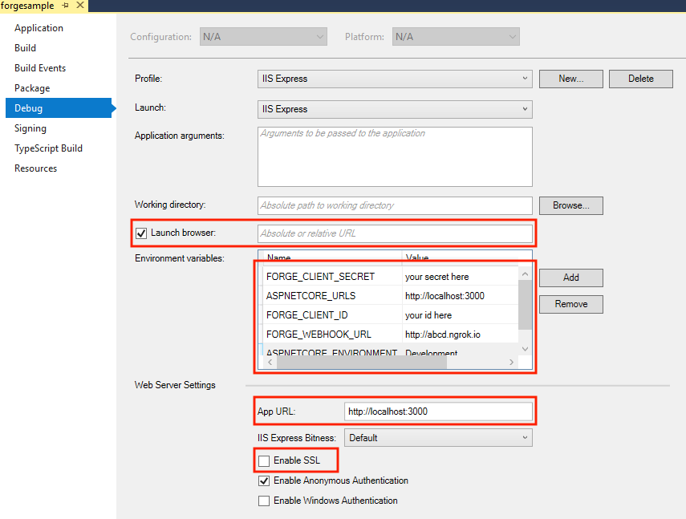

# design.automation-csharp-revit.window.family.create

# Description

This sample demostrated how to create a window family using Design Automation for Revit API **V3**.

This sample is based on Learn Forge [Design Automation Sample Tutorial](http://learnforge.autodesk.io/#/tutorials/modifymodels), the workflow is pretty similar, please make sure to go through that sample first, or you are already familiar with that. 

## Main Parts of The Work
1. Migrate the existing Revit WindowWizard Plugin to be used within AppBundle of Design Automation for Revit. Please check [PlugIn](./FamilyCreationPlugin/) 

2. Create your App, upload the AppBundle, define your Activity and test the workitem with the Postman collection under [Postman Collection](./PostmanCollection/) 

3. Create the Web App to call the workitem.

## How to use
1. Build the solution to create one AppBundle under `wwwroot/bundles`;
2. Create/Update AppBundle & Activity in `Configure` dialog;
3. Select window style, either `Double Hung`, `Fixed`, or `Sliding Double`;
4. Add a couple of family types, and change the parameters accordingly, set the material for `Glass Pane` and `Sash`, and change the family file name if necessary;
5. Select a Window family template file;
6. Click the `Start workitme` button, it will upload the file and execute the workitem, the status and result will be displayed in the log, the generated Window family file will also be there for download;

## Thumbnail

# Setup

## Prerequisites

1. **Forge Account**: Learn how to create a Forge Account, activate subscription and create an app at [this tutorial](http://learnforge.autodesk.io/#/account/). 
2. **Visual Studio**: Either Community (Windows) or Code (Windows, MacOS).
3. **.NET Core** basic knowledge with C#
4. **ngrok**: Routing tool, [download here](https://ngrok.com/)
7. **Revit** 2019: required to compile changes into the plugin

## Running locally

Clone this project or download it. It's recommended to install [GitHub desktop](https://desktop.github.com/). To clone it via command line, use the following (**Terminal** on MacOSX/Linux, **Git Shell** on Windows):

    git clone https://github.com/johnonsoftware/design.automation-csharp-revit.window.family.create

**Visual Studio** (Windows):

Right-click on the project, then go to **Debug**. Adjust the settings as shown below. 

 

The environment variables you need to set should be as above, most of them are same as detailed in [Design Automation Sample Tutorial](http://learnforge.autodesk.io/#/environment/setup/netcore). The only one you need to notice is `FORGE_DESIGN_AUTOMATION_NICKNAME`, if you already set a `NickName` for your Forge App, e.g. revitiomycompanyname, please input the value of `NickName` here, if you don't set a `NickName`, you can ignore this environment variable, just leave it as it is.

- "ASPNETCORE_ENVIRONMENT": "Development",
- "ASPNETCORE_URLS" : "http://localhost:3000",
- "FORGE_CLIENT_ID": "Your Forge App Client Id",
- "FORGE_CLIENT_SECRET": "Your Forge App Client Secret",
- "FORGE_WEBHOOK_URL": "your ngrok address here: e.g. http://abcd1234.ngrok.io",
- "FORGE_DESIGN_AUTOMATION_NICKNAME": "", 

**ngrok**

Run `ngrok http 3000 -host-header="localhost:3000"` to create a tunnel to your local machine, then copy the address into the `FORGE_WEBHOOK_URL` environment variable.

**Revit plugin**

A compiled version of the `Revit` plugin (.bundles) is included on the `WebApp` module, under `wwwroot/bundles` folder. Any changes on these plugins will require to create a new .bundle, the **Post-build** event should create it. Please review the readme for [FamilyCreationPlugin](https://github.com/JohnOnSoftware/design.automation-csharp-revit.window.family.create/tree/master/FamilyCreationPlugin)

**Start the app**

Open `http://localhost:3000` to start the app, follow the workflow I mentioned before.

# Further Reading

Documentation:

- [Data Management API](https://developer.autodesk.com/en/docs/data/v2/overview/)
- [Model Derivative API](https://forge.autodesk.com/en/docs/model-derivative/v2/)
- [Design Automation](https://forge.autodesk.com/en/docs/design-automation/v3/developers_guide/overview/)

Desktop APIs:

- [Revit](https://knowledge.autodesk.com/support/revit-products/learn-explore/caas/simplecontent/content/my-first-revit-plug-overview.html)

### Known Issues

### Tips & Tricks

This sample uses .NET Core and should work fine on both Windows and MacOS, did not verify on MacOS yet, but you can check [this tutorial for MacOS](https://github.com/augustogoncalves/dotnetcoreheroku) if you want to try.

## License

This sample is licensed under the terms of the [MIT License](http://opensource.org/licenses/MIT). Please see the [LICENSE](LICENSE) file for full details.

## Written by

Zhong Wu, [Forge Partner Development](http://forge.autodesk.com)
